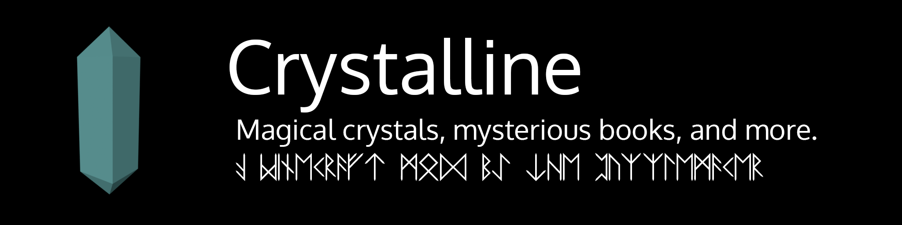

# Crystalline   

Crystalline is a Minecraft mod that adds various magical crystals to the game. These crystals, when overused, can cause insanity.

## Branch Information

This branch is for the current complete rewrite for 1.12. Eventually, there will be another branch for the 1.13 rewrite/update.

## Helpful Links

[Issues](https://github.com/ThePuzzlemaker/Crystalline/issues)

[CurseForge](https://www.curseforge.com/minecraft/mc-mods/crystalline)

[CI](https://ci.teamisotope.com/job/Crystalline/job/rewrite-1.12)

